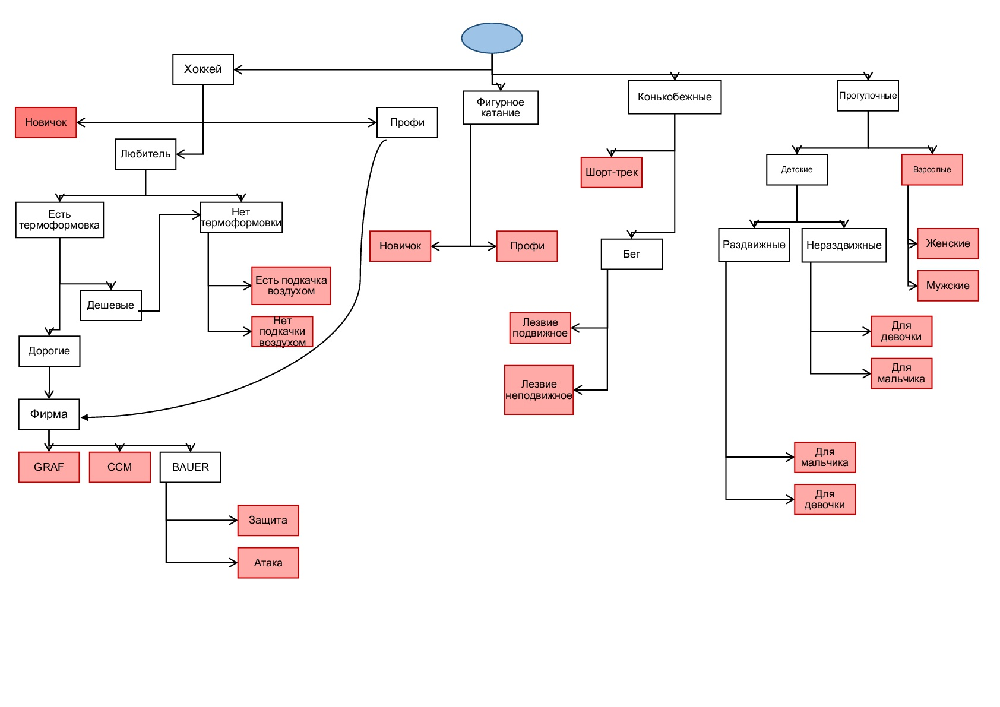
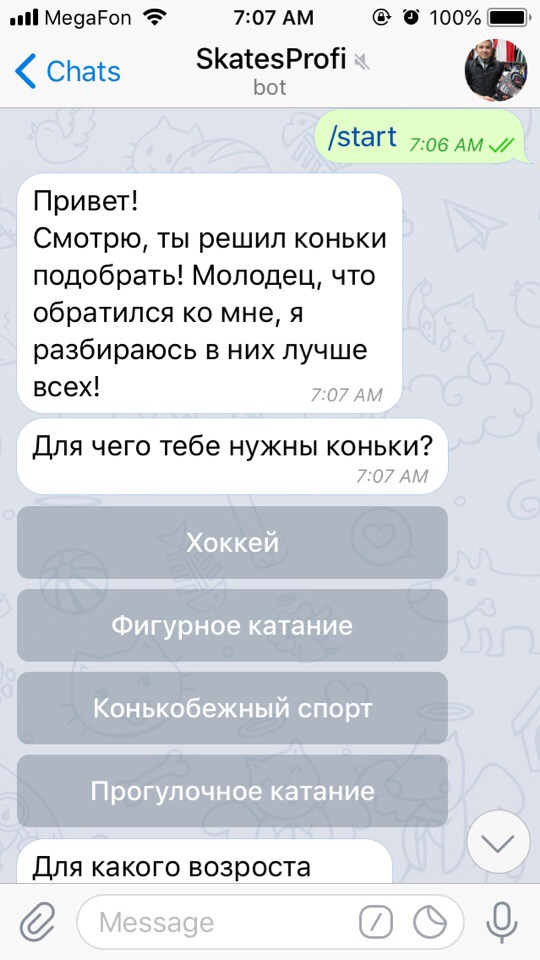
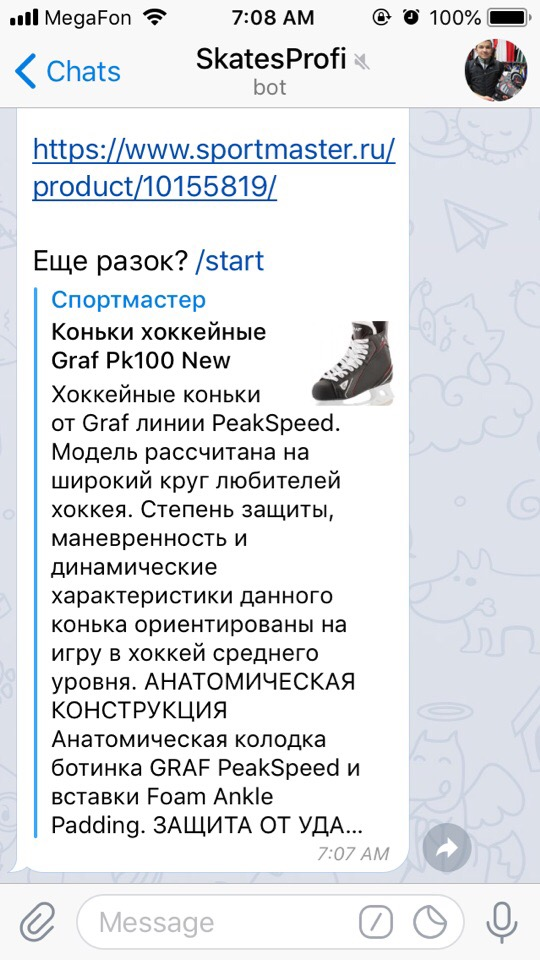

# Отчет по лабораторной работе
## по курсу "Искусственый интеллект"

### Студенты: 

| ФИО       | Роль в проекте                     | Оценка       |
|-----------|------------------------------------|--------------|
| Сахарин Никита | Реализовал оболочку ЭС на Прологе и описал общую схему предметной области | 3.8         |
| Сорокин Денис | Написание бота на С# |  3.8     |
| Якимович Александр| Тестирование |  3.8    |
| Похваленская Анна   | Написание отчёта |   3.8       |

## Результат проверки

| Преподаватель     | Дата         |  Оценка       |
|-------------------|--------------|---------------|
| Сошников Д.В. |  19.06.18            |    3.8           |

> Опоздание в сдаче финального отчёта на >2 нед. Экспертная система реализована в виде дерева, что не позволяет бороться с комбинаторным взрывом. В явном виде не используется представление знаний в виде понятных правил. В отчете практически не упоминается архитектура бота и используемые средства для его создания. 

## Тема работы

Для темы нашей лабораторной работы мы решили выбрать реализацию экспертной системы, которая бы позволила облегчить пользователю процесс выбора коньков для покупки с учетом его пожеланий по виду спорта и уровня подготовки в нем.

## Концептуализация предметной области

Опишите результаты концептуализации предметной области:
 - выделенные понятия
 - *связи между ними, тип получившейся онтологии (словарь, сеть, иерархия и т.д.):* в результате концепуализации предметной области получившаяся онтология имеет вид иерархии
 - опишите возможные статические и динамические знания
 - *как предметная область может быть разделена между участниками для коллективного создания базы знаний:* Создание базы знаний, по большей части, лежала на Денисе Сорокином, потому что он гораздо точнее разбирается в данной теме, ввиду своих спортивных увлечений. Остальные участники команды имели возможность корректировать базу знаний с позиции рядового пользователя (покупателя): какие бы параметры выбора казались наиболее полезными при выборе предмета с помощью реализованной экспертной системы.

## Принцип реализации системы

Опишите:
 - Какой механизм вывода вы предполагаете использовать и почему
 - Какую систему программирования вы предполагаете использовать и почему
 - Интеграция бота и системы на Прологе оуществляется с помощью общих файлов.

## Механизм вывода

Бот получает сообщение через кнопку, формируется запрос на основе ответа, запрос на языке пролог пишется в файл input.txt.
Дальше вызывается пролог программа с аргументами в виде этого файла и файла вывода output.txt , куда выводится результат работы пролога.

## Извлечение знаний

Извлечение знаний происходило посредством общения с чемпионом МСХЛ Денисом Сорокиным и его напарниками по команде. 

## Протокол работы системы

Проиллюстрируем примером. В это примере я буду выбирать коньки для себя.

Выбираем прогулочное катание.

Выбираем взрослые.

Выбираем для парня. Получаем в результате ссылку на товар в магазине.

Просто и удобно!

## Выводы

В ходе проделанной лаборатной работы мы получили новые и подкрепили уже имеющиеся навыки. Хочется, в первую очередь, отметить, что для каждого из нашей команды это был первый опыт создания экспертной систему. Так что полученные новые знания, несомненно, пригодятся в будущем, потому что, очевидно, что подобные задачи становятся все более и более актуальными. .... Лабораторная работа научила нас создавать экспертную систему с нуля, проходя все этапы от проектирования до тестирования, улучшила наши навыки командной работы.  Основные сложности составило осуществление взаимодействия программы на Прологе и чат бота. В заключение, нужно отметить, что получившаяся система может использоваться на практике, например в магазине спротивного снаряжения. Чтобы эффективно организовать командную работу мы разделили задание на части: реализация оболочки ЭС на Прологе и описание общей схемы предметной области, реализация бота, тестирование, составление отчёта.

Сформулируйте *содержательные* выводы по лабораторной работе. Чему он вас научила? 
Над чем заставила задуматься? В чём состояли основные сложности в работе? Насколько эффективной получилась командная работа, и какие методы для повышения эффективности командной работы вы использовали (scrum, slack, ...)?

Помните, что несодержательные выводы -
самая частая причина снижения оценки.
